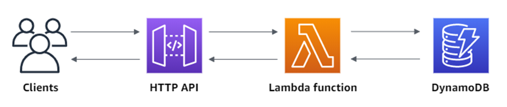

## AWS Lambda Performance comparison for all runtime 
This repo contains full code and all scripts for the most popular AWS Lambda flow:

#### The full analyze is here https://filia-aleks.medium.com/benchmarking-all-aws-lambda-runtimes-in-2021-cold-start-part-1-e4146fe89385

## Supported runtimes x86_64 and ARM
- Java 17
- NodeJs 14.x
- Python 3.9
- Go 1.17.7
- Ruby 2.7
- .Net 3.1
- Custom runtime with GraalVM 22.0
- Custom runtime with Rust 1.58.1

## How to build project

The project has CI/CD using GitHub Actions, please check GitHub workflow

### To build it manually you just need

- Docker
- SAM
- AWS account with S3 bucket in us-east-1 Region (update `existingS3Bucket` with your bucket value)
- run `build.sh` from the root

# Contribution
I’m not an expert in all these languages and I’m happy to see MR in the repo with performance improvements.

I’m going to support this repo and run the performance test every 3 months. I believe in opensource collaboration :)

